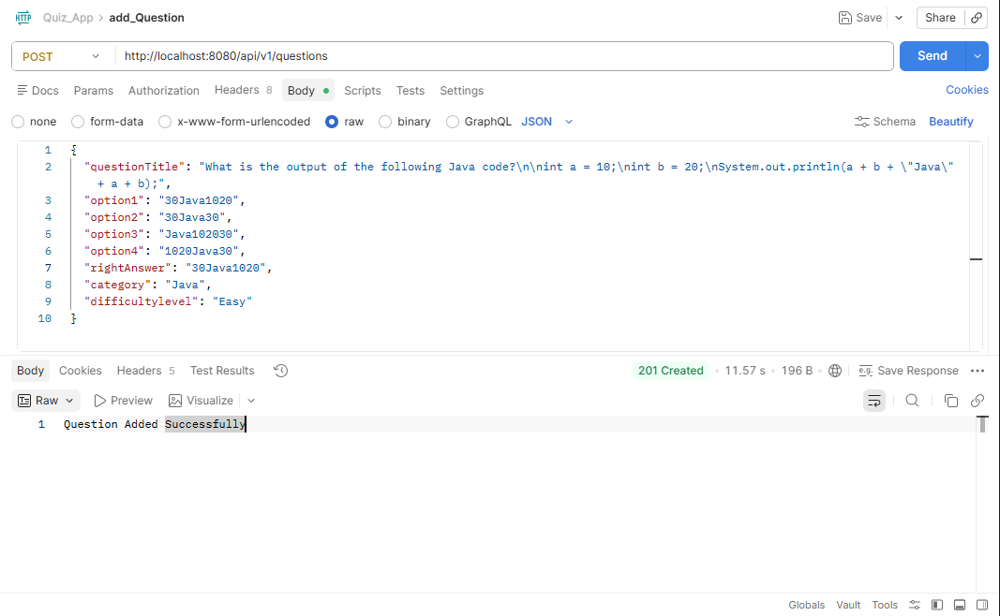
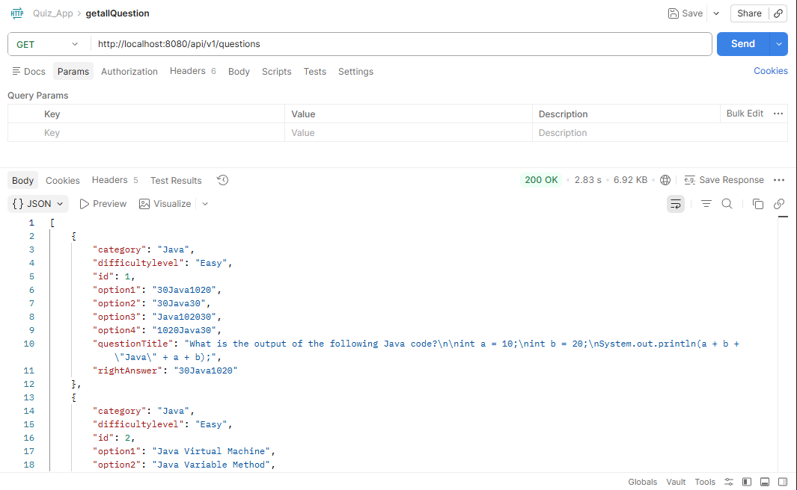
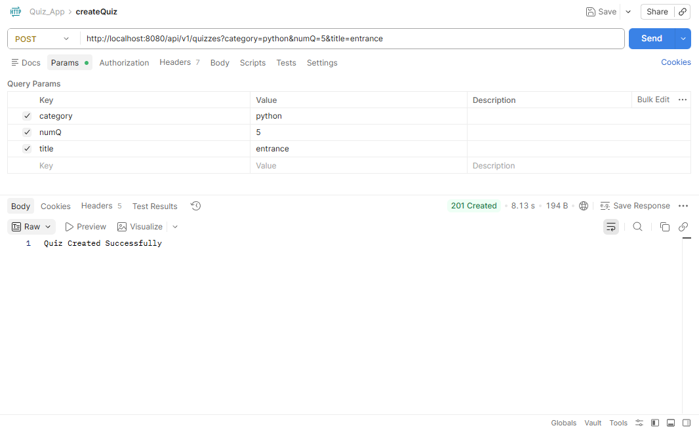
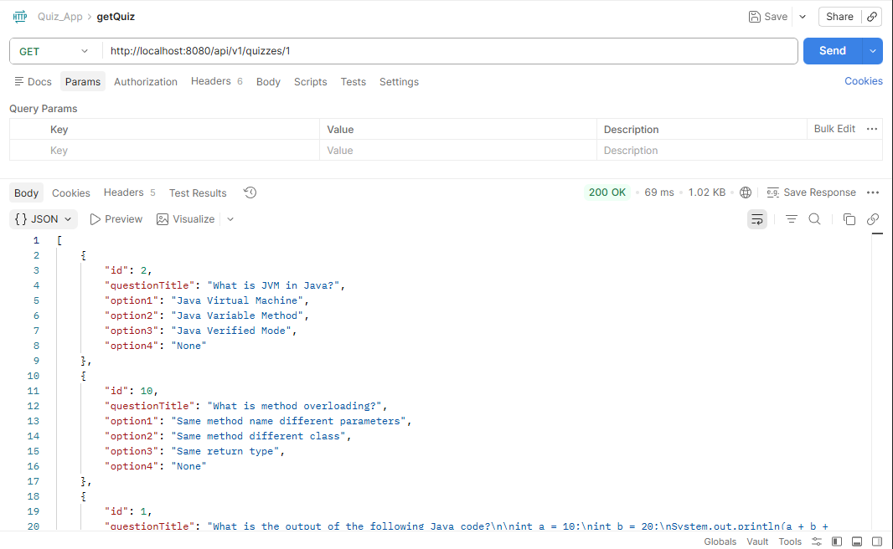
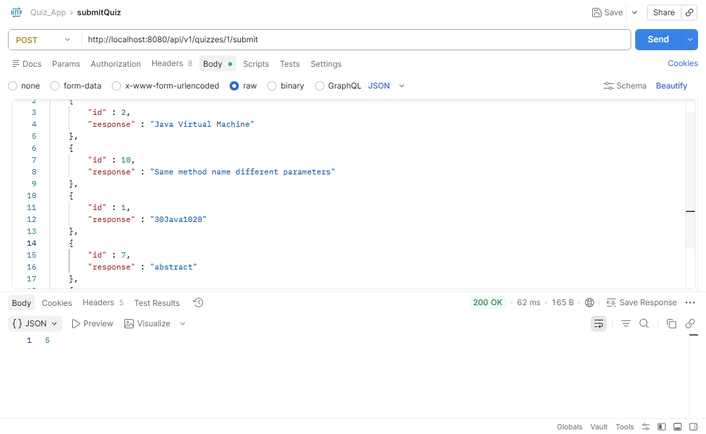

# 🧠 Quiz Application (Spring Boot)
-----------------------------------------------------------------------------------------------------------------------------------------

## 🚀 Features

* ➕ Add new questions
* 📚 Fetch all questions
* 🔍 Filter questions by category
* ❌ Delete questions
* 📝 Create quizzes dynamically
* 📥 Attempt quiz & submit answers
* ⚡ Instant score evaluation
* 🧱 Layered architecture (Controller → Service → Repository)
* ❗ Global exception handling

-----------------------------------------------------------------------------------------------------------------------------------------

## 🛠️ Tech Stack

| Technology      | Usage               |
| --------------- | ------------------- |
| Java            | Core programming    |
| Spring Boot     | Backend framework   |
| Spring Data JPA | Database operations |
| Hibernate       | ORM                 |
| MySQL           | Database            |
| Maven           | Build tool          |

-----------------------------------------------------------------------------------------------------------------------------------------

## 📂 Project Structure

```
src/main/java/com/example/QuizApp
│
├── controller     → REST APIs
├── service        → Business logic
├── repository     → Database layer
├── model          → Entity classes
├── dto            → Data transfer objects
├── exception      → Error handling
```

-----------------------------------------------------------------------------------------------------------------------------------------

## 📡 API Endpoints

### 🟢 Question APIs

#### ➕ Create Question

**POST** `/api/v1/questions`

#### 📚 Get All Questions

**GET** `/api/v1/questions`

#### 🔍 Get Questions by Category

**GET** `/api/v1/questions/category/{category}`

#### ❌ Delete Question

**DELETE** `/api/v1/questions/{id}`

-----------------------------------------------------------------------------------------------------------------------------------------

### 🔵 Quiz APIs

#### 📝 Create Quiz

**POST** `/api/v1/quizzes`

**Params:**

* `category`
* `numQ`
* `title`

#### 📥 Get Quiz

**GET** `/api/v1/quizzes/{id}`

#### 📤 Submit Quiz

**POST** `/api/v1/quizzes/{id}/submit`

-----------------------------------------------------------------------------------------------------------------------------------------

## 📮 API Testing (Postman)

All APIs are tested using Postman.

📁 Collection available:

```
QuizApp/postman/Quiz_App.postman_collection.json
```

### ▶️ How to Use

1. Open Postman
2. Click **Import**
3. Select the collection file
4. Run APIs directly

-----------------------------------------------------------------------------------------------------------------------------------------

## 📸 Screenshots

### ➕ Create Question



### 📚 Get All Questions



### 🔍 Get by Category


### ❌ Delete Question


### 📝 Create Quiz



### 📥 Get Quiz



### 📤 Submit Quiz



-----------------------------------------------------------------------------------------------------------------------------------------

## ⚙️ Setup & Run

### 1️⃣ Clone Repository

```bash
git clone https://github.com/MURUGESAN007/quiz-app-spring-boot.git
cd quiz-app-spring-boot
```

### 2️⃣ Configure Database

Update `application.properties`:

```properties
spring.datasource.url=jdbc:mysql://localhost:3306/quizdb
spring.datasource.username=root
spring.datasource.password=yourpassword

spring.jpa.hibernate.ddl-auto=update
```

### 3️⃣ Run Application

```bash
mvn spring-boot:run
```

-----------------------------------------------------------------------------------------------------------------------------------------

## ❗ Exception Handling

* Global exception handling using `@ControllerAdvice`
* Custom exception: `ResourceNotFoundException`
* Meaningful HTTP status codes

-----------------------------------------------------------------------------------------------------------------------------------------

## 🔮 Future Enhancements

* 🧩 Migrate monolithic architecture to Microservices
* 🌐 API Gateway implementation for centralized routing
* 🔍 Service Discovery using Eureka Server
* 🔗 Inter-service communication using OpenFeign
* ⚙️ Centralized configuration management
* 🔐 JWT Authentication & Authorization
* 👨‍🏫 Role-based access control (Admin / Teacher / Student)
* 📊 Distributed monitoring and health checks
* 🐳 Docker containerization for all services
* ☸️ Deployment orchestration with Kubernetes
* 🏆 Leaderboard & performance analytics service
* ⏱️ Timed quiz scheduling service
* 📩 Notification service for quiz updates

-----------------------------------------------------------------------------------------------------------------------------------------

## 👨‍💻 Author

**Murugesan S**
📍 Chennai, India

-----------------------------------------------------------------------------------------------------------------------------------------

## ⭐ Support

If you found this project useful, consider giving it a ⭐ on GitHub!

-----------------------------------------------------------------------------------------------------------------------------------------

## 📌 Note

This project demonstrates backend development skills using Spring Boot and follows clean architecture principles suitable for real-world Applications.
